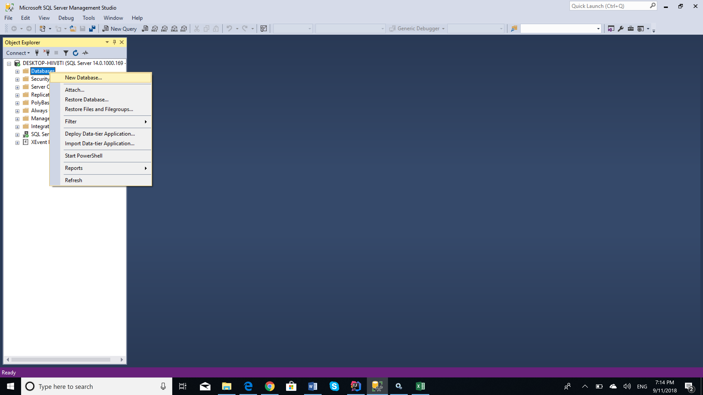

# DB
Task 1: Creați o bază de date plasată fizic în mapa MyDocuments\Data,fixînd o creștere a fișierului primar a bazei de 16MB cu limita de creștere de 128MB și a log-ului de 64 MB cu limita de creștere de 1024 MB.Pentru fișierele secundare de 64 MB cu limita de 1024 MB.

