# DB
Task 1: Creați o bază de date plasată fizic în mapa MyDocuments\Data,fixînd o creștere a fișierului primar a bazei de 16MB cu limita de creștere de 128MB și a log-ului de 64 MB cu limita de creștere de 1024 MB.Pentru fișierele secundare de 64 MB cu limita de 1024 MB.

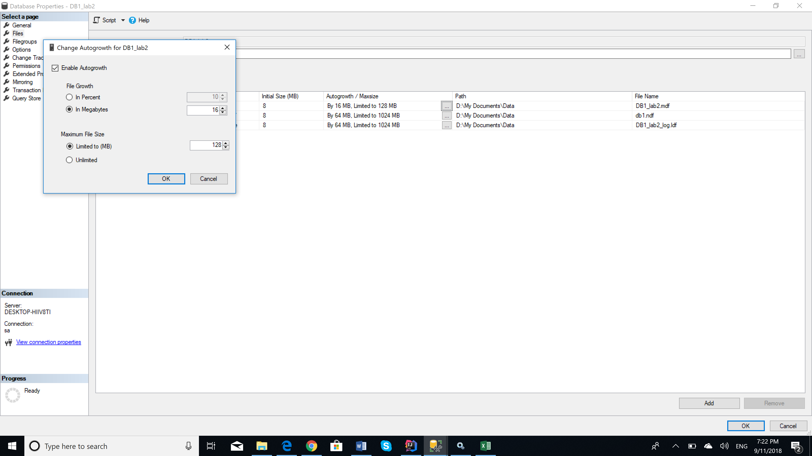
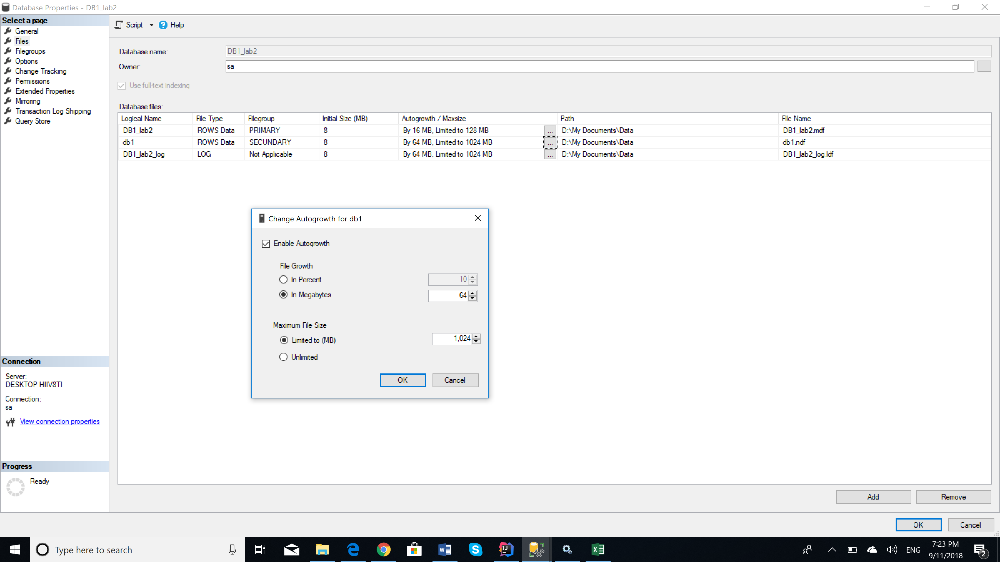

Task 2: Creați o bază de date, unde fișierul log să fie fizic în mapa MyDocuments/Log, numele fișierului log în mediul sistemului de operare trebuie să se deosebească de cel logic definit în schema fizică. Este important ca baza de date create să fie compatibilă cu sistemul MS SQL Server 2017 și ea să fie accesibilă numai unui singur utilizator într-un moment de timp.
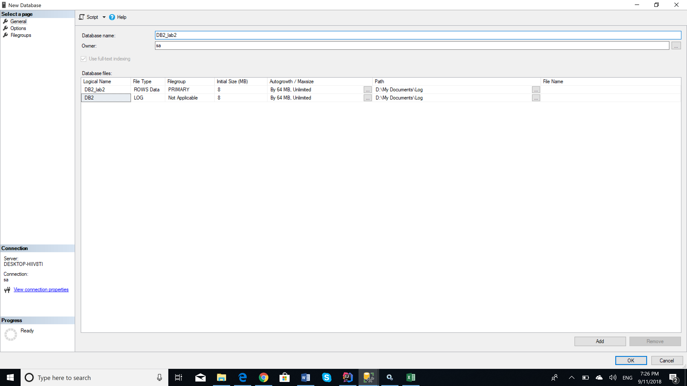
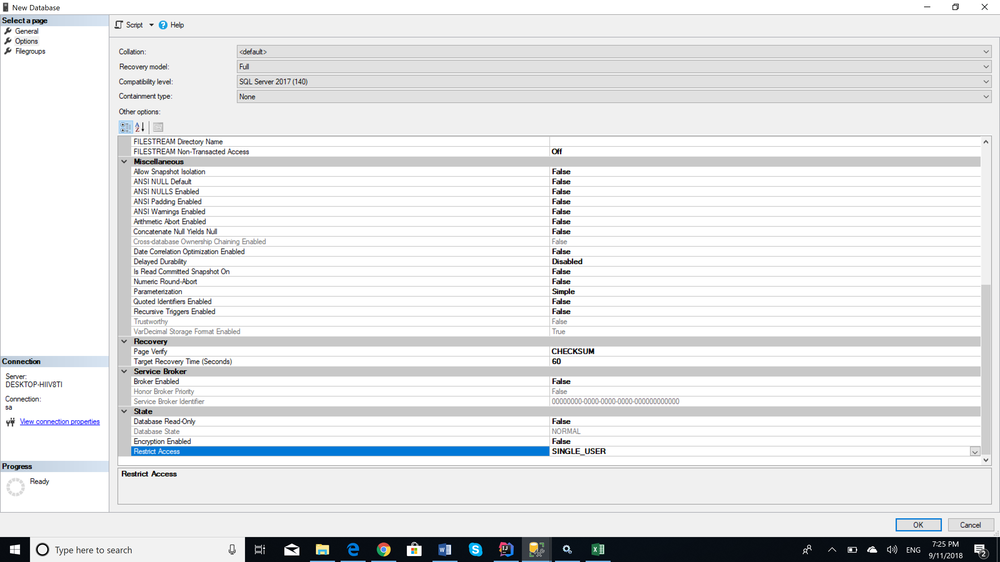

Task 3: Creați planul de întreținere a bazei de date, construită in sarcina 1. Spațiul neutilizat de
fișierele bazei de date trebuie îndepartat atunci când el atinge mărimea 2000Mb. Spațiul
eliberat trebuie sa fie returnat sistemului de operare. Aceasta operațiune trebuie să ruleze în
fiecare vineri, la ora 00:00. Raportul executării planului de întreținere trebuie salvat in docarul
MyDocuments\SQL_event_logs. Inițializați executarea planului. Dupa executare, verificați
rezultatele In fișierul log.
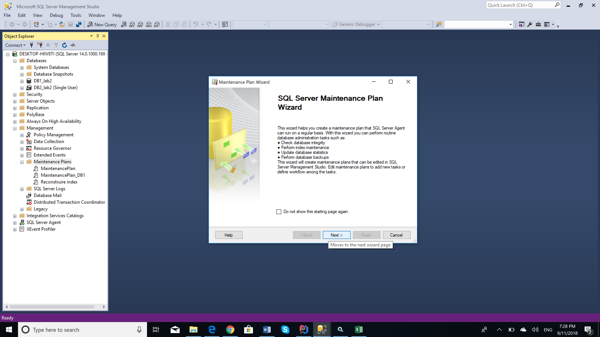

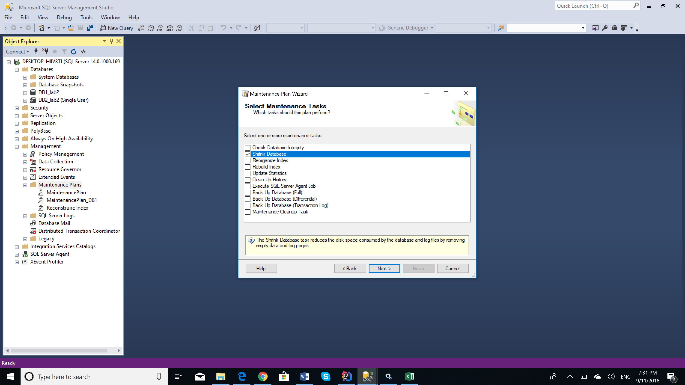
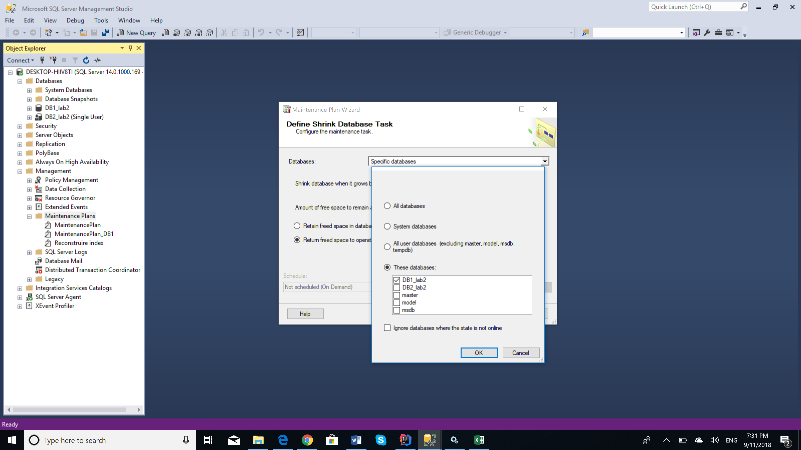
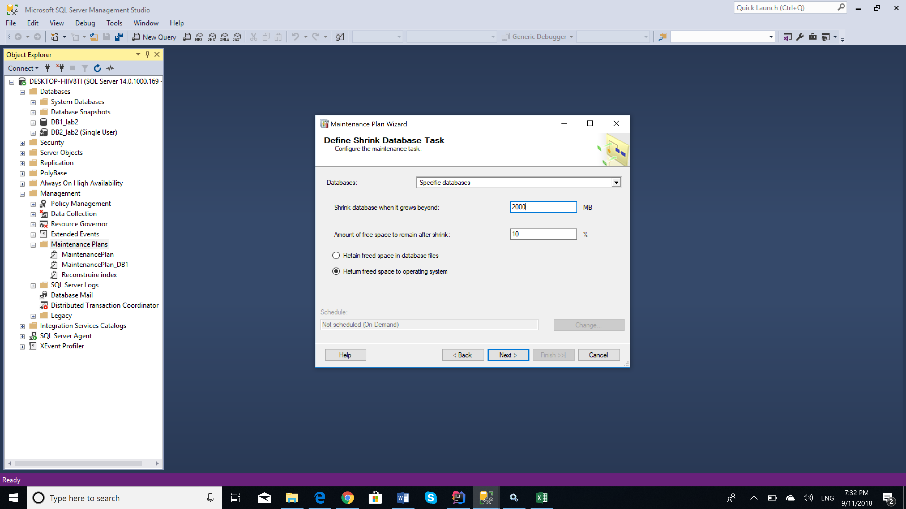
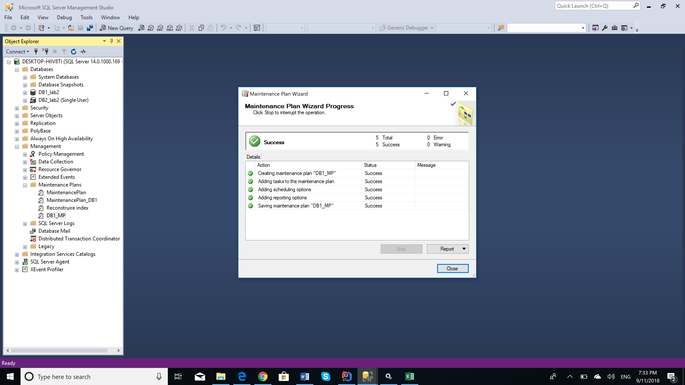
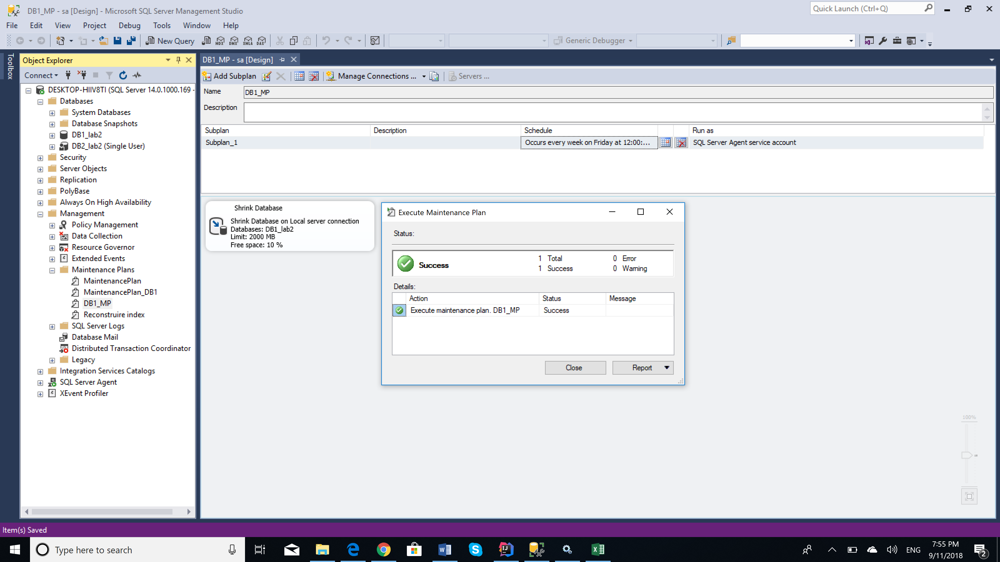

Task 4: Creați planul de întreținere a bazei de date, construite in exercițiul 2. Numele planului va fi:,,Reconstruire index". În cadrul acestui plan, sistemul trebuie să realizeze reconstruirea
indecșilor numai asupra tabelelor de baza (exclusiv viziunilor) din toate schemele care există
în baza de date în cauza. Spațiul liber pe pagina trebuie să fie 10%. Sortarea indecșilor trebuie să se realizeze în tempdb. După reconstruire, trebuie să urmeze colectarea statisticilor complete despre indecșii reconstruiți. Al treilea pas al planului trebuie să constituie sarcina de ștergere a istoriei despre operatiile de Backup-Restore ce au avut loc pe SQL Server. Trebuie șters istoricul care este mai vechi de 6 saptamani. Acest plan trebuie sa fie executat în fiecare prima duminică a lunii. Creați dosarul MyDocuments\SQL_reports. Raportul de executare a planului trebuie să fie adaugat în acest fișier. Inițializați executarea planului. Dupa executare, verificati rezultatele in fișierul log
generat.
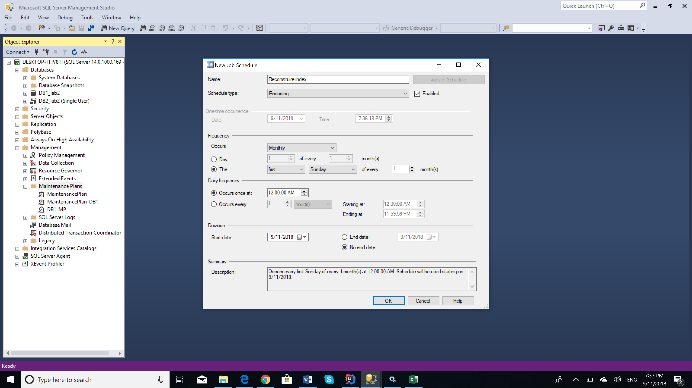
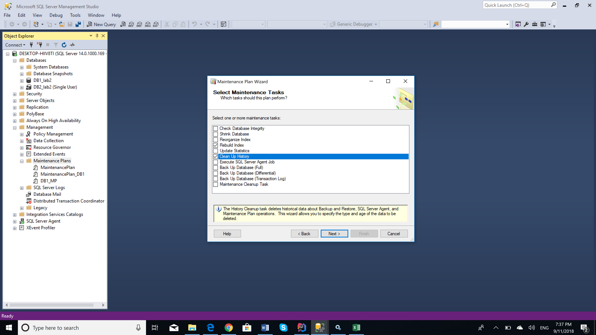
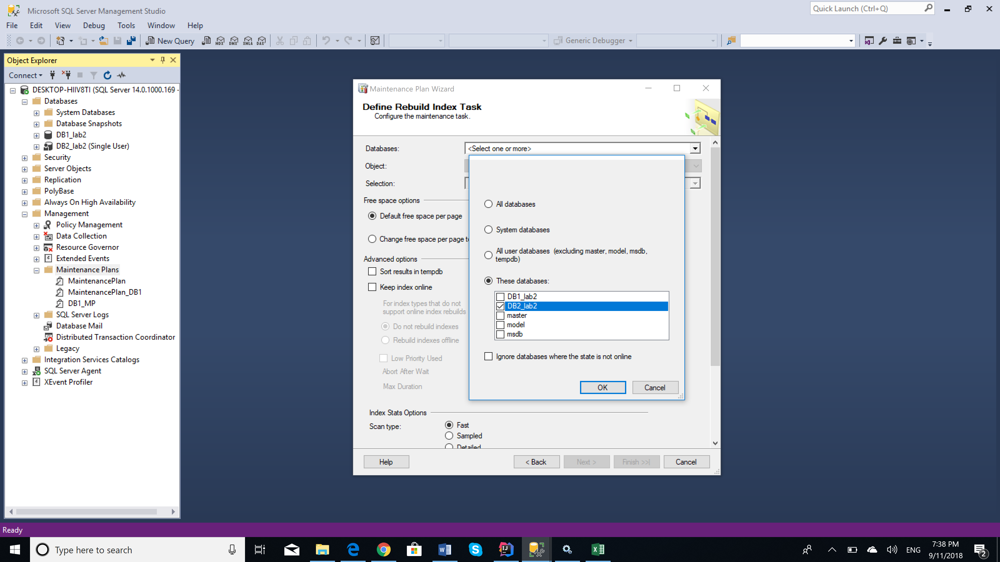
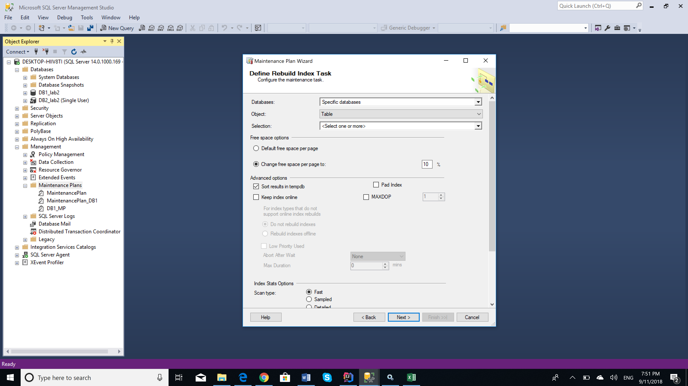

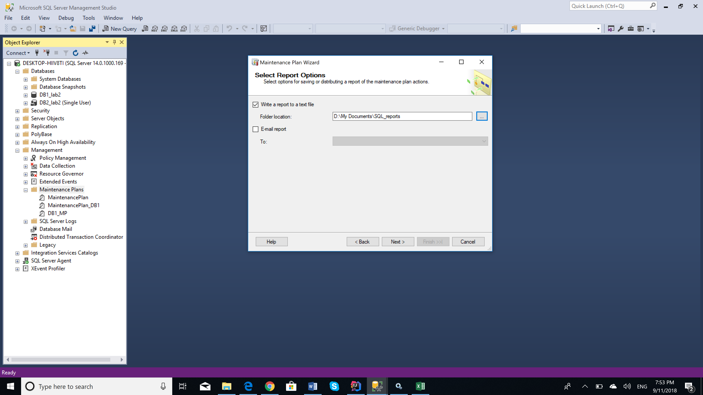
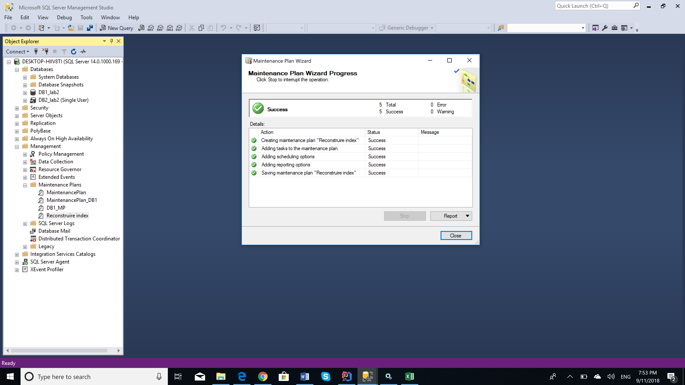
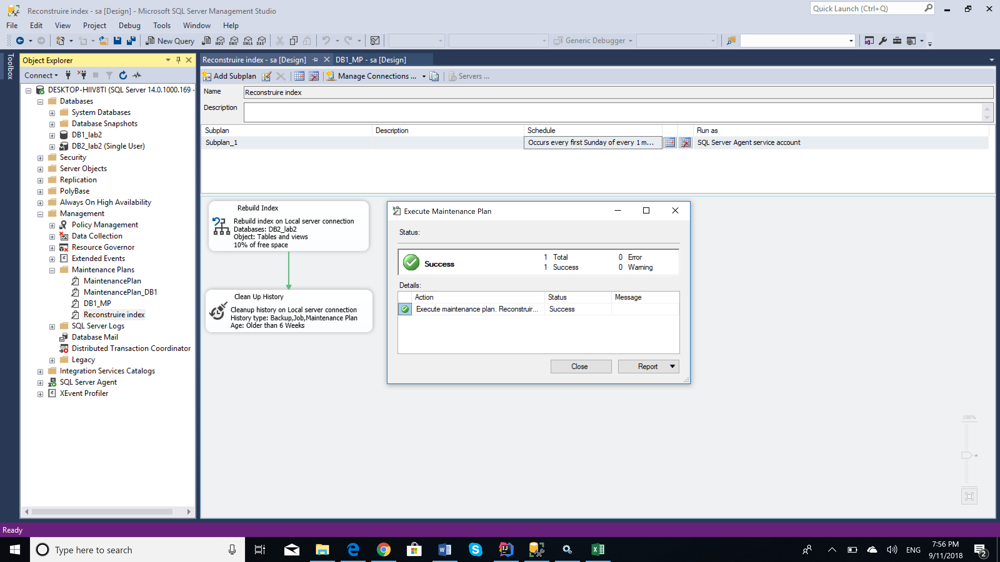
